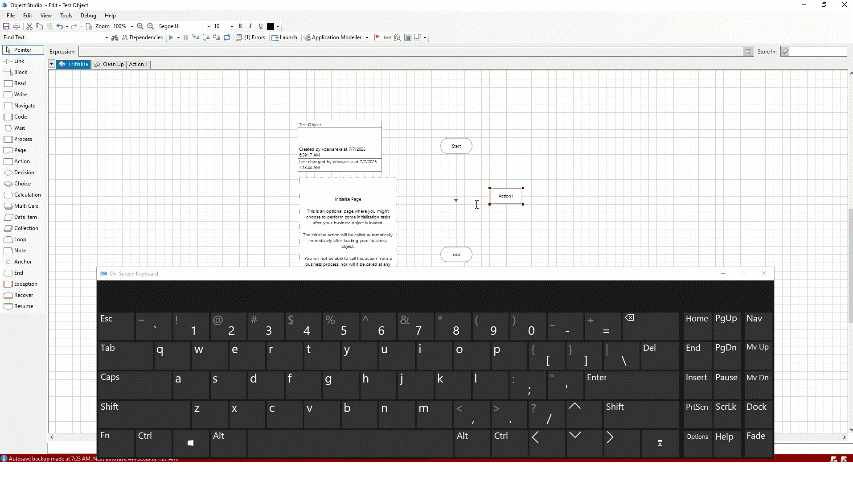

# Blue Prism v7.4 Keyboard Shortcuts

If you're working in Blue Prism v7.4, knowing these shortcut keys can significantly improve your development and debugging speed. Though the list of shortcut keys shared here is applicable for Blue Prism v7.4, it is common for most of the other Blue Prism versions as well.

## Debugging Shortcuts
Below are some of the shortcut keys I found to be very helpful while debugging the bot:

| Keys |	Action |
|------|---------|
| `F5`	| Run | 
| `F11`	| Step |
| `SHIFT` + `F11`	| Step Out |
| `F10`	| Step Over |
| `CTRL` + `SHIFT` + `F5`	| Reset |
| `SHIFT` + `F5`	| Refresh |
| Right-click + `R`	| Run to this stage |
| Right-click + `N`	| Set next stage |
| Right-click + `B`	| Breakpoint |

## Quick Access to Tools
To insert commonly used stages quickly, refer these function keys:

| Keys | Action |
|------|--------|
| `F2`	| Pointer |
| `F3`	| Link |
| `F4` |	Action |
| `F6` |	Decision |
| `F7`	| Calculation |
| `F8` | Data Item |
| `F9`	| Collection |

To insert additional tools via Alt shortcuts:

| Keys |	Action |
|------|---------|
| `ALT` + `T` + `E`	| Process |
| `ALT` + `T` + `G` |	Page |
| `ALT` + `T` + `H`	| Choice |
| `ALT` + `T` + `M`	| Multiple Calculation |
| `ALT` + `T` + `L`	| Loop |
| `ALT` + `T` + `N`	| End |
| `ALT` + `T` + `R`	| Read |
| `ALT` + `T` + `W` |	Write |
| `ALT` + `T` + `V`	| Navigate |
| `ALT` + `T` + `D`	| Code |
| `ALT` + `T` + `I`	| Wait |
| `CTRL` + `I` |	Application Modeller |

## Auto-Linking stages
Want to insert a stage between two existing ones? 
Just `right-click` the new stage, hold `Alt`, and drag it between the two stages. 
Blue Prism will automatically link the stages!  

## Basic Editor Actions

| Keys |	Action |
|------|---------|
| `DELETE` |	Delete stage |
| `CTRL` + `Z` |	Undo |
| `CTRL` + `Y`	| Redo |
| `CTRL` + `C`	| Copy |
| `CTRL` + `V`	| Paste |
| `CTRL` + `X`	| Cut |
| `CTRL` + `Mouse wheel` or `CTRL` + `+/-`	| Zoom In / Out |

> Note: Some keys may vary based on Blue Prism configuration or updates. You can also find shortcuts by hovering over toolbar buttons or checking the menu options to discover more accelerator keys (e.g., `Alt + F` for File menu).

License: [CC BY 4.0](https://creativecommons.org/licenses/by/4.0/)
